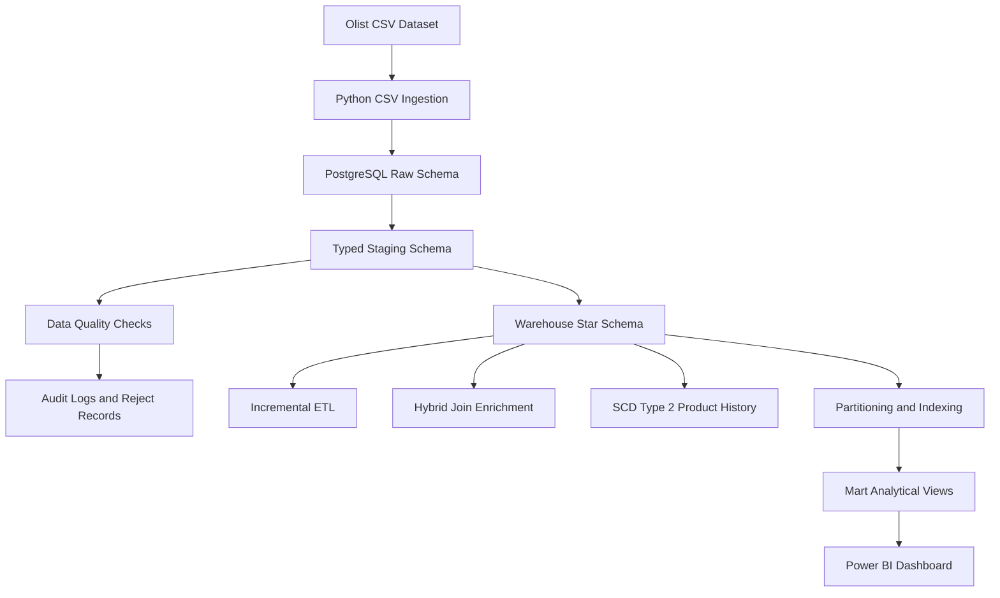

# Production-Style E-Commerce Data Engineering Platform

## 1. Project Overview

This project is a production-style e-commerce data engineering platform built using **Python, PostgreSQL, SQL, DBeaver, VS Code, and Power BI**.

The project takes raw e-commerce CSV files, loads them into a PostgreSQL database, applies proper data typing and quality checks, builds a star-schema data warehouse, implements advanced ETL concepts, and prepares analytical data marts for dashboard reporting.

The main goal of this project is to demonstrate a realistic end-to-end data engineering workflow, not just basic SQL queries. It covers practical concepts used in real data engineering and database roles, including:

- Raw data ingestion
- Staging layer design
- Data quality validation
- ETL audit logging
- Star-schema warehouse modeling
- Incremental ETL
- Hybrid Join inspired enrichment
- SCD Type 2 product history tracking
- Partitioning
- Indexing
- Query optimization
- Dashboard-ready mart views
- Power BI reporting
- GitHub-based project documentation

---

## 2. Business Problem

E-commerce businesses generate large amounts of operational data from customers, orders, payments, products, sellers, deliveries, and reviews.

Raw CSV files are not directly suitable for analytics because they may contain:

- Inconsistent data types
- Missing values
- Duplicate keys
- Invalid business values
- Date inconsistencies
- Multiple relational entities spread across different files
- Data that needs to be modeled for reporting

This project solves that problem by building a structured data pipeline that transforms raw e-commerce data into a clean, validated, analytics-ready data warehouse.

The final warehouse supports business questions such as:

- What is the monthly revenue trend?
- Which product categories generate the most revenue?
- Which sellers perform best?
- Which payment methods are most used?
- How many orders are delivered late?
- What is the review score trend?
- Which customer locations generate the highest sales?

---

## 3. Tech Stack

| Tool / Technology | Purpose |
|---|---|
| Python | ETL scripting and pipeline automation |
| PostgreSQL | Database, warehouse, schemas, indexes, partitioning |
| SQL | Data modeling, transformations, quality checks, mart views |
| DBeaver | Database development and query testing |
| VS Code | Source code and project development |
| Power BI | Dashboard and business reporting |
| Git | Version control |
| GitHub | Portfolio hosting and project documentation |
| psycopg2 | Python PostgreSQL connector |
| pandas | Dataset profiling and CSV inspection |
| python-dotenv | Environment variable management |

---

## 4. Dataset

This project uses the **Olist Brazilian E-Commerce Public Dataset**.

The dataset contains multiple CSV files related to an e-commerce marketplace.

### CSV Files Used

| CSV File | Description |
|---|---|
| `olist_customers_dataset.csv` | Customer details and customer location information |
| `olist_geolocation_dataset.csv` | Brazilian zip code, city, state, latitude, and longitude data |
| `olist_order_items_dataset.csv` | Products/items included in each order |
| `olist_order_payments_dataset.csv` | Payment type, installments, and payment amount |
| `olist_order_reviews_dataset.csv` | Customer review score and review comments |
| `olist_orders_dataset.csv` | Order status and order timeline dates |
| `olist_products_dataset.csv` | Product attributes and category information |
| `olist_sellers_dataset.csv` | Seller details and seller location |
| `product_category_name_translation.csv` | Portuguese to English product category mapping |

> Note: Raw dataset CSV files are not uploaded to GitHub because dataset files can be large. The `data/raw/` folder is ignored using `.gitignore`.

---

## 5. Project Architecture



---

## 6. Database Layer Design

The database is divided into multiple schemas to follow a professional data engineering structure.

| Schema | Purpose |
|---|---|
| `raw` | Stores original CSV data as text without modification |
| `staging` | Stores cleaned and typed data converted from raw tables |
| `audit` | Stores ETL logs, data quality results, and rejected records |
| `warehouse` | Stores final star-schema dimensions and fact tables |
| `mart` | Stores dashboard-ready analytical views |

---

## 7. End-to-End Pipeline Flow

### Step 1: Dataset Profiling

The dataset is first profiled using Python to understand:

- Number of rows
- Number of columns
- Column names
- Inferred data types
- Missing values
- Example values

Generated file:

```text
docs/dataset_profile.md
```

Python file:

```text
src/profile_dataset.py
```

---

### Step 2: Database and Schema Setup

A PostgreSQL database is created for the project:

```text
ecommerce_etl_db
```

A project user is used:

```text
ecommerce_etl_user
```

Schemas created:

```text
raw
staging
warehouse
mart
audit
```

SQL file:

```text
sql/01_create_schemas.sql
```

---

### Step 3: Raw Layer Creation

Raw tables are created based on the original CSV files.

All raw columns are stored mostly as `TEXT`.

Reason:

- Raw layer should preserve original source data.
- No transformation is applied at this stage.
- Data type conversion is handled in the staging layer.

SQL file:

```text
sql/02_create_raw_tables.sql
```

Raw tables:

```text
raw.olist_customers_dataset
raw.olist_geolocation_dataset
raw.olist_order_items_dataset
raw.olist_order_payments_dataset
raw.olist_order_reviews_dataset
raw.olist_orders_dataset
raw.olist_products_dataset
raw.olist_sellers_dataset
raw.product_category_name_translation
```

---

### Step 4: Python CSV Ingestion

CSV files are loaded from:

```text
data/raw/
```

into PostgreSQL raw tables using Python.

Main Python files:

```text
src/db_connection.py
src/load_raw.py
```

`db_connection.py` reads database settings from `.env` and creates a PostgreSQL connection.

`load_raw.py` loads the CSV files into matching raw tables using PostgreSQL `COPY`.

This approach is faster than inserting records row by row.

---

### Step 5: Staging Layer

The staging layer converts raw text data into proper data types.

Examples:

| Raw Type | Staging Type |
|---|---|
| `TEXT` | `VARCHAR` |
| `TEXT` | `INTEGER` |
| `TEXT` | `NUMERIC` |
| `TEXT` | `TIMESTAMP` |
| `TEXT` | `BOOLEAN` where needed later |

SQL file:

```text
sql/03_create_staging_tables.sql
```

Staging tables:

```text
staging.customers
staging.geolocation
staging.order_items
staging.order_payments
staging.order_reviews
staging.orders
staging.products
staging.sellers
staging.product_category_translation
```

---

### Step 6: Data Quality and Audit Layer

Data quality checks are applied to staging tables before loading the warehouse.

Quality checks include:

- Null primary/business keys
- Duplicate business keys
- Negative prices
- Negative payment values
- Invalid review scores
- Delivery date before purchase date
- Approval date before purchase date
- Missing customer references
- Missing product references
- Missing seller references
- Missing order references

SQL file:

```text
sql/04_data_quality_checks.sql
```

Audit tables:

```text
audit.etl_run_log
audit.data_quality_log
audit.etl_reject_records
```

These tables store:

- Pipeline execution status
- Total rows checked
- Rejected rows
- Check names
- Issue counts
- Severity levels
- Failed validation records

This makes the project more realistic because real data pipelines need monitoring and quality validation.

---

### Step 7: Warehouse Star Schema

The staging data is transformed into a star-schema warehouse.

SQL file:

```text
sql/05_create_warehouse_tables.sql
```

### Dimension Tables

| Table | Purpose |
|---|---|
| `warehouse.dim_customer` | Customer details |
| `warehouse.dim_product` | Product details and English category names |
| `warehouse.dim_seller` | Seller details |
| `warehouse.dim_date` | Date dimension for time-based analysis |
| `warehouse.dim_payment_type` | Payment method dimension |
| `warehouse.dim_geolocation` | Aggregated geolocation information |

### Fact Tables

| Table | Purpose |
|---|---|
| `warehouse.fact_orders` | Order-level facts |
| `warehouse.fact_order_items` | Item-level sales facts |
| `warehouse.fact_payments` | Payment facts |
| `warehouse.fact_reviews` | Review facts |

The warehouse supports reporting on:

- Revenue
- Orders
- Products
- Sellers
- Payments
- Reviews
- Delivery performance
- Customer locations

---

## 8. Advanced ETL Modules

This project includes advanced data engineering modules to make it more than a basic SQL project.

---

### 8.1 Incremental ETL

Python file:

```text
src/incremental_load.py
```

Control table:

```text
audit.etl_control
```

Log table:

```text
audit.incremental_load_log
```

Incremental ETL uses a timestamp-based control mechanism.

Instead of reloading the full dataset every time, the pipeline checks:

```sql
WHERE order_purchase_timestamp > last_loaded_timestamp
```

This allows only new records to be processed.

The script also uses:

```sql
ON CONFLICT DO NOTHING
```

to avoid duplicate inserts.

This simulates a real production ETL process where daily or hourly new data is loaded without reprocessing everything.

---

### 8.2 Hybrid Join Inspired Enrichment

Python file:

```text
src/hybrid_join_loader.py
```

Output table:

```text
warehouse.hybrid_join_enriched_order_items
```

This module simulates near-real-time order item enrichment.

Flow:

```text
Incoming order items
        ↓
Extract product_id and seller_id
        ↓
Lookup product and seller master data
        ↓
Enrich incoming records
        ↓
Load enriched records into warehouse table
```

The full dataset version processes `staging.order_items` in batches instead of only processing a small sample.

The Hybrid Join module enriches order items with:

- Product category
- English product category
- Seller city
- Seller state
- Item price
- Freight value
- Total item cost

This demonstrates how incoming transactional data can be joined with master data during ETL.

---

### 8.3 SCD Type 2 Product History

Python file:

```text
src/scd_type2.py
```

SCD table:

```text
warehouse.dim_product_scd2
```

SCD Type 2 is used to maintain product history.

Instead of overwriting product changes, the pipeline:

1. Closes the old product version
2. Sets `is_current = false`
3. Adds `effective_end_date`
4. Inserts a new current version
5. Sets `is_current = true`

This is useful when product attributes change over time and historical reporting must remain accurate.

Columns used for SCD Type 2:

```text
effective_start_date
effective_end_date
is_current
record_hash
```

The `record_hash` helps detect whether a product record has changed.

---

## 9. Partitioning, Indexing, and Query Optimization

SQL file:

```text
sql/07_partitioning_and_indexes.sql
```

This step improves database performance and demonstrates optimization skills.

### Partitioning

A partitioned order fact table is created:

```text
warehouse.fact_orders_partitioned
```

Partitions are created by year:

```text
warehouse.fact_orders_2016
warehouse.fact_orders_2017
warehouse.fact_orders_2018
warehouse.fact_orders_2019
```

Partitioning helps PostgreSQL scan only relevant partitions for date-based queries.

Example:

```sql
WHERE purchase_date >= '2018-01-01'
AND purchase_date < '2018-02-01'
```

This allows partition pruning.

---

### Indexing

Indexes are created on important analytical and join columns, such as:

```text
customer_key
purchase_date_key
order_status
order_id
product_key
seller_key
payment_type_key
review_score
year
month
```

Indexes improve performance for joins, filters, and dashboard queries.

---

### Query Optimization

`EXPLAIN ANALYZE` is used to check query execution plans.

This helps understand:

- Query cost
- Execution time
- Table scans
- Index scans
- Partition pruning
- Join strategy

---

## 10. Analytical Mart Views

SQL file:

```text
sql/08_create_mart_views.sql
```

The mart layer contains dashboard-ready views.

| View | Purpose |
|---|---|
| `mart.monthly_revenue_view` | Monthly revenue, orders, freight, and customer cost |
| `mart.top_products_view` | Product category revenue and item sales |
| `mart.seller_performance_view` | Seller revenue, orders, and item sales |
| `mart.delivery_delay_view` | Delivery status and late order analysis |
| `mart.payment_method_analysis_view` | Payment method revenue and installments |
| `mart.review_score_trend_view` | Review score trends by month |
| `mart.customer_location_sales_view` | Customer city and state sales analysis |

Power BI connects only to the `mart` views instead of raw or staging tables.

This follows a clean reporting architecture.

---

## 11. Power BI Dashboard

The Power BI dashboard is built using the mart views.

Dashboard file:

```text
dashboards/ecommerce_dashboard.pbix
```

Screenshots are stored in:

```text
docs/
```

### Dashboard Pages

#### Page 1: Executive Summary

Includes:

- Total Orders
- Total Revenue
- Average Item Cost
- Monthly Revenue Trend
- Revenue vs Freight by Month
- Top 10 Product Categories
- Payment Method Share
- Year slicer

#### Page 2: Product and Seller Performance

Includes:

- Total Sellers
- Total Items Sold
- Top Sellers by Revenue
- Seller Performance Summary
- Product Category Revenue vs Items Sold
- Seller state filter

#### Page 3: Delivery, Payments, and Reviews

Includes:

- Delivery status and late orders
- Average delivery days
- Payment method revenue
- Review score trend
- Delivery performance summary
- Payment type and review score filters

---

## 12. Project Folder Structure

```text
ECOMMERCE ETL PROJECT/
│
├── data/
│   ├── raw/
│   ├── processed/
│   └── rejected/
│
├── sql/
│   ├── 01_create_schemas.sql
│   ├── 02_create_raw_tables.sql
│   ├── 03_create_staging_tables.sql
│   ├── 04_data_quality_checks.sql
│   ├── 05_create_warehouse_tables.sql
│   ├── 06_advanced_etl_objects.sql
│   ├── 07_partitioning_and_indexes.sql
│   └── 08_create_mart_views.sql
│
├── src/
│   ├── db_connection.py
│   ├── profile_dataset.py
│   ├── load_raw.py
│   ├── hybrid_join_loader.py
│   ├── scd_type2.py
│   └── incremental_load.py
│
├── docs/
│   ├── dataset_profile.md
│   ├── architecture_diagram.md
│   ├── dashboard_page_1_executive_summary.png
│   ├── dashboard_page_2_product_seller_performance.png
│   └── dashboard_page_3_delivery_payments_reviews.png
│
├── dashboards/
│   └── ecommerce_dashboard.pbix
│
├── requirements.txt
├── README.md
├── .gitignore
└── .env.example
```

---

## 13. Environment Variables

Create a `.env` file locally.

Example:

```env
DB_HOST=localhost
DB_PORT=5432
DB_NAME=ecommerce_etl_db
DB_USER=ecommerce_etl_user
DB_PASSWORD=your_password
```

> The actual `.env` file is ignored by Git and should not be uploaded to GitHub.

---

## 14. How to Run the Project

### Step 1: Create Virtual Environment

```bash
python -m venv venv
```

Activate on Windows:

```bash
venv\Scripts\activate
```

Install dependencies:

```bash
pip install -r requirements.txt
```

---

### Step 2: Create Database and Schemas

Run in DBeaver:

```text
sql/01_create_schemas.sql
```

---

### Step 3: Create Raw Tables

Run:

```text
sql/02_create_raw_tables.sql
```

---

### Step 4: Load Raw CSV Files

Place CSV files in:

```text
data/raw/
```

Run:

```bash
python src/load_raw.py
```

---

### Step 5: Create Staging Tables

Run:

```text
sql/03_create_staging_tables.sql
```

---

### Step 6: Run Data Quality Checks

Run:

```text
sql/04_data_quality_checks.sql
```

---

### Step 7: Create Warehouse Tables

Run:

```text
sql/05_create_warehouse_tables.sql
```

---

### Step 8: Create Advanced ETL Objects

Run:

```text
sql/06_advanced_etl_objects.sql
```

Then run:

```bash
python src/hybrid_join_loader.py
```

```bash
python src/scd_type2.py
```

```bash
python src/incremental_load.py
```

---

### Step 9: Create Partitions, Indexes, and Mart Views

Run:

```text
sql/07_partitioning_and_indexes.sql
```

Run:

```text
sql/08_create_mart_views.sql
```

---

### Step 10: Build Dashboard

Open Power BI Desktop and connect to PostgreSQL:

```text
Server: localhost:5432
Database: ecommerce_etl_db
Mode: Import
```

Load only the `mart` views.

---

## 15. Validation Queries

### Raw Row Counts

```sql
SELECT 'customers' AS table_name, COUNT(*) AS total_rows FROM raw.olist_customers_dataset
UNION ALL
SELECT 'geolocation', COUNT(*) FROM raw.olist_geolocation_dataset
UNION ALL
SELECT 'order_items', COUNT(*) FROM raw.olist_order_items_dataset
UNION ALL
SELECT 'payments', COUNT(*) FROM raw.olist_order_payments_dataset
UNION ALL
SELECT 'reviews', COUNT(*) FROM raw.olist_order_reviews_dataset
UNION ALL
SELECT 'orders', COUNT(*) FROM raw.olist_orders_dataset
UNION ALL
SELECT 'products', COUNT(*) FROM raw.olist_products_dataset
UNION ALL
SELECT 'sellers', COUNT(*) FROM raw.olist_sellers_dataset
UNION ALL
SELECT 'category_translation', COUNT(*) FROM raw.product_category_name_translation;
```

### Warehouse Row Counts

```sql
SELECT 'dim_customer' AS table_name, COUNT(*) AS total_rows FROM warehouse.dim_customer
UNION ALL
SELECT 'dim_product', COUNT(*) FROM warehouse.dim_product
UNION ALL
SELECT 'dim_seller', COUNT(*) FROM warehouse.dim_seller
UNION ALL
SELECT 'dim_date', COUNT(*) FROM warehouse.dim_date
UNION ALL
SELECT 'fact_orders', COUNT(*) FROM warehouse.fact_orders
UNION ALL
SELECT 'fact_order_items', COUNT(*) FROM warehouse.fact_order_items
UNION ALL
SELECT 'fact_payments', COUNT(*) FROM warehouse.fact_payments
UNION ALL
SELECT 'fact_reviews', COUNT(*) FROM warehouse.fact_reviews;
```

### Data Quality Results

```sql
SELECT
    check_name,
    table_name,
    check_type,
    issue_count,
    severity,
    check_status
FROM audit.data_quality_log
ORDER BY severity DESC, issue_count DESC;
```

### Mart Views

```sql
SELECT table_schema, table_name
FROM information_schema.views
WHERE table_schema = 'mart'
ORDER BY table_name;
```

---

## 16. Key Project Highlights

This project demonstrates:

- End-to-end data engineering pipeline development
- PostgreSQL database design
- SQL scripting
- Python ETL automation
- Raw and staging architecture
- Data quality validation
- Audit logging
- Star-schema data warehouse design
- Fact and dimension modeling
- Incremental ETL
- Hybrid Join inspired enrichment
- SCD Type 2 implementation
- Partitioning
- Indexing
- Query optimization
- Power BI dashboarding
- GitHub project documentation

---

## 17. Interview Explanation

A short explanation of this project:

> I built an end-to-end e-commerce data engineering platform using Python, PostgreSQL, and Power BI. The project loads raw CSV files into a raw schema, converts them into typed staging tables, performs data quality checks, and builds a star-schema warehouse. I also implemented advanced ETL features such as incremental loading, Hybrid Join inspired enrichment, SCD Type 2 product history, partitioning, indexing, and analytical mart views for Power BI reporting.

---

## 18. CV Project Bullet

**Production-Style E-Commerce Data Engineering Platform**  
Built an end-to-end data engineering pipeline using Python, PostgreSQL, and Power BI. Implemented raw-to-staging ingestion, data quality validation, ETL audit logging, star-schema warehouse modeling, incremental ETL, Hybrid Join enrichment, SCD Type 2 product history, partitioning, indexing, query optimization, analytical marts, and dashboard reporting.

---

## 19. Future Improvements

Possible future improvements:

- Add Apache Airflow orchestration
- Add dbt models for warehouse transformations
- Add Docker support
- Add automated unit tests for ETL scripts
- Add CI/CD using GitHub Actions
- Add cloud deployment on AWS RDS or Azure PostgreSQL
- Add Kafka-based real-time order stream simulation
- Add Power BI service publishing
- Add API endpoints using FastAPI

---

## 20. Repository Notes

The following files are intentionally not uploaded:

```text
.env
venv/
data/raw/
logs/
*.pbix
```

These files are excluded using `.gitignore` because they contain credentials, large files, temporary logs, or local environment data.
