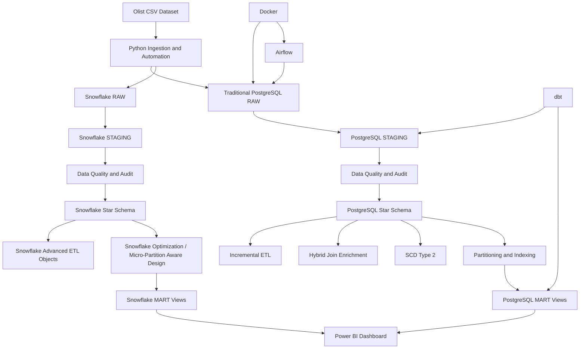

# Production-Style E-Commerce Data Engineering & Cloud Warehouse Platform

## 1. Project Overview

This project is a comprehensive, production-style e-commerce data engineering platform built across multiple implementation stages using **Python, PostgreSQL, SQL, Docker, Apache Airflow, dbt, Snowflake, DBeaver, VS Code, Power BI, Git, and GitHub**.

The project began with a traditional relational data engineering implementation using PostgreSQL and was progressively extended into a broader engineering platform with:

- Docker-based reproducible deployment
- Airflow orchestration
- dbt modeling, testing, documentation, and lineage
- PostgreSQL-to-Snowflake cloud warehouse migration
- Automated Snowflake ingestion and warehouse rebuild through Python
- Analytical mart views for Power BI reporting
- Git/GitHub-based version control and documentation

The platform takes raw e-commerce CSV files, loads them into a database or cloud warehouse, applies data typing and quality checks, builds a star-schema data warehouse, implements advanced ETL concepts, and prepares analytical data marts for dashboard reporting.

The main goal of this project is to demonstrate a realistic end-to-end data engineering workflow rather than only basic SQL queries. It covers practical concepts used in real data engineering, ETL engineering, cloud warehouse, SQL development, database, and BI roles, including:

- Raw data ingestion
- Staging layer design
- Data quality validation
- ETL audit logging
- Star-schema warehouse modeling
- Incremental ETL
- Hybrid Join inspired enrichment
- SCD Type 2 product history tracking
- Partitioning
- Indexing
- Query optimization
- Docker containerization
- Docker Compose multi-service deployment
- Apache Airflow orchestration
- dbt modular SQL modeling
- dbt testing
- dbt documentation and lineage
- PostgreSQL-to-Snowflake migration
- Snowflake virtual warehouses
- Snowflake internal staging
- Snowflake `PUT` and `COPY INTO`
- Automated Snowflake pipeline execution
- Dashboard-ready mart views
- Power BI reporting
- GitHub-based project documentation
- Reproducible local and cloud-oriented project workflows

---

## 2. Business Problem

E-commerce businesses generate large amounts of operational data from customers, orders, payments, products, sellers, deliveries, geolocation records, and reviews.

Raw CSV files are not directly suitable for analytics because they may contain:

- Inconsistent data types
- Missing values
- Duplicate keys
- Invalid business values
- Date inconsistencies
- Multiple relational entities spread across different files
- Data that needs to be modeled for reporting
- Records that require validation before entering an analytical warehouse
- Large lookup/reference datasets that need structured enrichment
- Data that needs to be transformed into business-ready KPIs

This project solves that problem by building a structured data pipeline that transforms raw e-commerce data into a clean, validated, analytics-ready data warehouse.

The final warehouse supports business questions such as:

- What is the monthly revenue trend?
- Which product categories generate the most revenue?
- Which sellers perform best?
- Which payment methods are most used?
- How many orders are delivered late?
- What is the review score trend?
- Which customer locations generate the highest sales?
- What is the average delivery duration?
- Which sellers generate the largest share of revenue?
- How do revenue, freight, product demand, delivery, payment, and review behavior change over time?

---

## 3. Technology Stack

| Tool / Technology | Purpose |
|---|---|
| Python | ETL scripting, ingestion, automation, validation, and database/cloud integration |
| PostgreSQL | Traditional relational database and initial warehouse implementation |
| Snowflake | Managed cloud analytical warehouse and migration target |
| SQL | Data modeling, transformations, data quality checks, warehouse logic, mart views |
| Docker | Reproducible runtime and containerized deployment |
| Docker Compose | Multi-service orchestration for PostgreSQL, ETL, and Airflow environments |
| Apache Airflow | DAG-based ETL orchestration, dependencies, monitoring, and task execution |
| dbt | Modular SQL transformations, sources, tests, documentation, and lineage |
| DBeaver | Database development, testing, inspection, and query execution |
| VS Code | Source code, SQL, Python, Docker, Airflow, and dbt development |
| Power BI | Dashboarding and business reporting |
| Git | Version control |
| GitHub | Portfolio hosting, repository management, and documentation |
| psycopg2 | Python PostgreSQL connector |
| snowflake-connector-python | Python Snowflake connector |
| pandas | Dataset profiling and CSV inspection |
| python-dotenv | Environment variable management |
| Redis | Airflow broker/service dependency in the Dockerized Airflow environment |
| PostgreSQL Airflow Metadata DB | Airflow metadata persistence |

---

## 4. Dataset

This project uses the **Olist Brazilian E-Commerce Public Dataset**.

The dataset contains multiple CSV files related to an e-commerce marketplace.

### CSV Files Used

| CSV File | Description |
|---|---|
| `olist_customers_dataset.csv` | Customer details and customer location information |
| `olist_geolocation_dataset.csv` | Brazilian zip code, city, state, latitude, and longitude data |
| `olist_order_items_dataset.csv` | Products/items included in each order |
| `olist_order_payments_dataset.csv` | Payment type, installments, and payment amount |
| `olist_order_reviews_dataset.csv` | Customer review score and review comments |
| `olist_orders_dataset.csv` | Order status and order timeline dates |
| `olist_products_dataset.csv` | Product attributes and category information |
| `olist_sellers_dataset.csv` | Seller details and seller location |
| `product_category_name_translation.csv` | Portuguese to English product category mapping |

### Validated Dataset Row Counts

| Dataset | Rows |
|---|---:|
| Customers | 99,441 |
| Geolocation | 1,000,163 |
| Order Items | 112,650 |
| Order Payments | 103,886 |
| Order Reviews | 99,224 |
| Orders | 99,441 |
| Products | 32,951 |
| Sellers | 3,095 |
| Product Category Translation | 71 |

> **Note:** Raw dataset CSV files are not uploaded to GitHub because dataset files can be large. The `data/raw/` folder is ignored using `.gitignore`.

---

## 5. Project Evolution

This repository represents the evolution of one data platform across multiple engineering stages.

### Version 1 — Traditional Relational ETL and Warehouse

```text
CSV
→ Python
→ PostgreSQL RAW
→ STAGING
→ DATA QUALITY / AUDIT
→ STAR-SCHEMA WAREHOUSE
→ MART VIEWS
→ Power BI
```

### Version 2 — Containerized Deployment

```text
Docker
→ PostgreSQL Container
→ Python ETL Container
→ Persistent Volumes
→ Port Mapping
→ Health Checks
→ Reproducible Deployment
```

### Version 3 — Airflow-Orchestrated Pipeline

```text
Airflow DAG
→ Create Schemas
→ Create Raw Tables
→ Load Raw Data
→ Build Staging
→ Run Data Quality
→ Build Warehouse
→ Run Advanced ETL
→ Create Marts
→ Validate Pipeline
```

### Version 4 — dbt Modeling and Lineage

```text
RAW Source
→ dbt Staging Model
→ Tests
→ Mart Model
→ Documentation
→ Lineage
```

### Version 5 — Snowflake Cloud Warehouse Migration

```text
Local CSV
→ Python / Snowflake Connector
→ Internal Stage
→ COPY INTO RAW
→ STAGING
→ AUDIT
→ WAREHOUSE
→ MART
```

### Version 6 — Automated Snowflake Rebuild

```text
python src/run_snowflake_pipeline.py
        ↓
Create Snowflake Objects
        ↓
Upload 9 CSV Files
        ↓
Load RAW
        ↓
Build STAGING
        ↓
Fix Timestamp Formats
        ↓
Run Data Quality
        ↓
Build Star Schema
        ↓
Create Advanced Objects
        ↓
Create Optimization Layer
        ↓
Create MART Views
        ↓
Final Validation
```

---

## 6. High-Level Architecture


```mermaid
flowchart TD
    A[Olist CSV Dataset] --> B[Python Ingestion and Automation]

    B --> C1[Traditional PostgreSQL RAW]
    B --> C2[Snowflake RAW]

    C1 --> D1[PostgreSQL STAGING]
    C2 --> D2[Snowflake STAGING]

    D1 --> E1[Data Quality and Audit]
    D2 --> E2[Data Quality and Audit]

    E1 --> F1[PostgreSQL Star Schema]
    E2 --> F2[Snowflake Star Schema]

    F1 --> G1[Incremental ETL]
    F1 --> G2[Hybrid Join Enrichment]
    F1 --> G3[SCD Type 2]
    F1 --> G4[Partitioning and Indexing]

    F2 --> H1[Snowflake Advanced ETL Objects]
    F2 --> H2[Snowflake Optimization / Micro-Partition Aware Design]

    G4 --> I1[PostgreSQL MART Views]
    H2 --> I2[Snowflake MART Views]

    I1 --> J[Power BI Dashboard]
    I2 --> J

    K[Docker] --> C1
    K --> L[Airflow]
    L --> C1

    M[dbt] --> D1
    M --> I1
```

---

## 7. Database and Warehouse Layer Design

The data platform is divided into multiple logical schemas.

| Schema | Purpose |
|---|---|
| `raw` / `RAW` | Stores original CSV data with minimal transformation |
| `staging` / `STAGING` | Stores cleaned and typed data |
| `audit` / `AUDIT` | Stores ETL logs, quality results, and rejected records |
| `warehouse` / `WAREHOUSE` | Stores star-schema dimensions, facts, SCD/history, enrichment, and optimization objects |
| `mart` / `MART` | Stores dashboard-ready analytical views |

---

## 8. End-to-End Pipeline Flow

### Step 1: Dataset Profiling

The dataset is first profiled using Python to understand:

- Number of rows
- Number of columns
- Column names
- Inferred data types
- Missing values
- Example values

Generated file:

```text
docs/dataset_profile.md
```

Python file:

```text
src/profile_dataset.py
```

---

### Step 2: Traditional Database and Schema Setup

The initial relational implementation uses PostgreSQL.

Database:

```text
ecommerce_etl_db
```

Project user:

```text
ecommerce_etl_user
```

Schemas created:

```text
raw
staging
warehouse
mart
audit
```

SQL file:

```text
sql/01_create_schemas.sql
```

This initial implementation serves as the traditional relational baseline from which the wider platform was containerized, orchestrated, and later migrated to Snowflake.

---

### Step 3: Raw Layer Creation

Raw tables are created based on the original CSV files.

All raw columns are stored mostly as `TEXT`.

Reasons:

- Raw layer should preserve original source data.
- No transformation is applied at this stage.
- Data type conversion is handled in the staging layer.
- Ingestion is less likely to fail because of unexpected source formatting.
- Original source values remain available for debugging.

SQL file:

```text
sql/02_create_raw_tables.sql
```

Raw tables:

```text
raw.olist_customers_dataset
raw.olist_geolocation_dataset
raw.olist_order_items_dataset
raw.olist_order_payments_dataset
raw.olist_order_reviews_dataset
raw.olist_orders_dataset
raw.olist_products_dataset
raw.olist_sellers_dataset
raw.product_category_name_translation
```

---

### Step 4: Python CSV Ingestion

CSV files are loaded from:

```text
data/raw/
```

into PostgreSQL raw tables using Python.

Main Python files:

```text
src/db_connection.py
src/load_raw.py
```

`db_connection.py` reads database settings from `.env` and creates a PostgreSQL connection.

`load_raw.py` loads the CSV files into matching raw tables using PostgreSQL `COPY`.

This approach is faster than inserting records row by row.

---

### Step 5: Staging Layer

The staging layer converts raw text data into proper data types.

Examples:

| Raw Type | Staging Type |
|---|---|
| `TEXT` | `VARCHAR` |
| `TEXT` | `INTEGER` |
| `TEXT` | `NUMERIC` |
| `TEXT` | `TIMESTAMP` |
| `TEXT` | `BOOLEAN` where needed later |

SQL file:

```text
sql/03_create_staging_tables.sql
```

Staging tables:

```text
staging.customers
staging.geolocation
staging.order_items
staging.order_payments
staging.order_reviews
staging.orders
staging.products
staging.sellers
staging.product_category_translation
```

The staging process includes:

- `TRIM`
- Empty-string handling
- Numeric casting
- Timestamp casting
- Text normalization
- City-name lowercasing where required
- Controlled null conversion

---

### Step 6: Data Quality and Audit Layer

Data quality checks are applied to staging tables before warehouse loading.

Quality checks include:

- Null primary/business keys
- Duplicate business keys
- Negative prices
- Negative freight values
- Negative payment values
- Invalid review scores
- Delivery date before purchase date
- Approval date before purchase date
- Missing customer references
- Missing product references
- Missing seller references
- Missing order references

SQL file:

```text
sql/04_data_quality_checks.sql
```

Audit tables:

```text
audit.etl_run_log
audit.data_quality_log
audit.etl_reject_records
```

These tables store:

- Pipeline execution status
- Total rows checked
- Rejected rows
- Check names
- Issue counts
- Severity levels
- Failed validation records
- Start and end timestamps
- Execution messages

This makes the project more realistic because real data pipelines need monitoring, validation, and traceability.

---

### Step 7: Warehouse Star Schema

The staging data is transformed into a star-schema warehouse.

SQL file:

```text
sql/05_create_warehouse_tables.sql
```

### Dimension Tables

| Table | Purpose |
|---|---|
| `warehouse.dim_customer` | Customer details |
| `warehouse.dim_product` | Product details and English category names |
| `warehouse.dim_seller` | Seller details |
| `warehouse.dim_date` | Date dimension for time-based analysis |
| `warehouse.dim_payment_type` | Payment method dimension |
| `warehouse.dim_geolocation` | Aggregated geolocation information |

### Fact Tables

| Table | Purpose |
|---|---|
| `warehouse.fact_orders` | Order-level facts |
| `warehouse.fact_order_items` | Item-level sales facts |
| `warehouse.fact_payments` | Payment facts |
| `warehouse.fact_reviews` | Review facts |

The warehouse supports reporting on:

- Revenue
- Orders
- Products
- Sellers
- Payments
- Reviews
- Delivery performance
- Customer locations
- Item-level cost
- Freight
- Review response time
- Late deliveries

---

## 9. Advanced ETL Modules

This project includes advanced data engineering modules to make it more than a basic SQL project.

---

### 9.1 Incremental ETL

Python file:

```text
src/incremental_load.py
```

Control table:

```text
audit.etl_control
```

Log table:

```text
audit.incremental_load_log
```

Incremental ETL uses a timestamp-based control mechanism.

Instead of reloading the full dataset every time, the pipeline checks:

```sql
WHERE order_purchase_timestamp > last_loaded_timestamp
```

This allows only new records to be processed.

The PostgreSQL implementation also uses:

```sql
ON CONFLICT DO NOTHING
```

to avoid duplicate inserts.

This simulates a real production ETL process where daily or hourly new data is loaded without reprocessing everything.

The incremental logging design records:

- Last loaded timestamp
- New maximum timestamp
- Candidate rows
- Inserted rows
- Skipped rows
- Execution status
- Execution message

---

### 9.2 Hybrid Join Inspired Enrichment

Python file:

```text
src/hybrid_join_loader.py
```

Output table:

```text
warehouse.hybrid_join_enriched_order_items
```

This module simulates near-real-time order item enrichment.

Flow:

```text
Incoming order items
        ↓
Extract product_id and seller_id
        ↓
Lookup product and seller master data
        ↓
Enrich incoming records
        ↓
Load enriched records into warehouse table
```

The full dataset version processes `staging.order_items` in batches instead of only processing a small sample.

The Hybrid Join module enriches order items with:

- Product category
- English product category
- Seller city
- Seller state
- Item price
- Freight value
- Total item cost

This demonstrates how incoming transactional data can be joined with master data during ETL.

---

### 9.3 SCD Type 2 Product History

Python file:

```text
src/scd_type2.py
```

SCD table:

```text
warehouse.dim_product_scd2
```

SCD Type 2 is used to maintain product history.

Instead of overwriting product changes, the pipeline:

1. Closes the old product version
2. Sets `is_current = false`
3. Adds `effective_end_date`
4. Inserts a new current version
5. Sets `is_current = true`

This is useful when product attributes change over time and historical reporting must remain accurate.

Columns used for SCD Type 2:

```text
effective_start_date
effective_end_date
is_current
record_hash
```

The `record_hash` helps detect whether a product record has changed.

---

## 10. PostgreSQL Partitioning, Indexing, and Query Optimization

SQL file:

```text
sql/07_partitioning_and_indexes.sql
```

This step improves database performance and demonstrates optimization skills in the traditional relational implementation.

### Partitioning

A partitioned order fact table is created:

```text
warehouse.fact_orders_partitioned
```

Partitions are created by year:

```text
warehouse.fact_orders_2016
warehouse.fact_orders_2017
warehouse.fact_orders_2018
warehouse.fact_orders_2019
```

Partitioning helps PostgreSQL scan only relevant partitions for date-based queries.

Example:

```sql
WHERE purchase_date >= '2018-01-01'
AND purchase_date < '2018-02-01'
```

This allows partition pruning.

### Indexing

Indexes are created on important analytical and join columns, such as:

```text
customer_key
purchase_date_key
order_status
order_id
product_key
seller_key
payment_type_key
review_score
year
month
```

Indexes improve performance for joins, filters, and dashboard queries.

### Query Optimization

`EXPLAIN ANALYZE` is used to inspect query execution plans.

This helps understand:

- Query cost
- Execution time
- Table scans
- Index scans
- Partition pruning
- Join strategy

---

## 11. Docker Containerization and Reproducible Deployment

The platform was extended with Docker to make the environment reproducible and easier to deploy.

Main files:

```text
Dockerfile
.dockerignore
compose.yaml
deploy.ps1
src/run_pipeline.py
```

### Dockerized Components

- PostgreSQL database
- Python ETL runtime
- Project dependencies
- Persistent database storage
- Environment-based configuration

### Docker Concepts Applied

- Custom Docker image
- Docker Compose services
- Port mapping
- Persistent volumes
- Environment variables
- Service dependencies
- Health checks
- Rebuildable runtime
- One-command deployment

Typical command:

```bash
docker compose up -d --build
```

The Dockerized implementation allows the project to be reproduced on another machine without manually recreating the entire PostgreSQL and Python environment.

---

## 12. Apache Airflow Orchestration

The project includes a Dockerized Apache Airflow environment.

Main Airflow files:

```text
compose.airflow.yaml
Dockerfile.airflow
.env.airflow
dags/airflow_smoke_test.py
dags/ecommerce_etl_dag.py
```

The Airflow environment contains services such as:

- Airflow API server
- Airflow scheduler
- Airflow DAG processor
- Airflow triggerer
- Airflow worker
- Airflow initialization service
- PostgreSQL metadata database
- Redis

### Airflow DAG Flow

The complete PostgreSQL-oriented ETL workflow was divided into independent Airflow tasks:

```text
create_schemas
        ↓
create_raw_tables
        ↓
load_raw_csv_files
        ↓
create_staging_tables
        ↓
run_data_quality_checks
        ↓
create_warehouse
        ↓
create_advanced_etl_objects
        ↓
run_hybrid_join
        ↓
run_scd_type2
        ↓
run_incremental_load
        ↓
create_partitions_and_indexes
        ↓
create_mart_views
        ↓
validate_pipeline
```

### Why Airflow Was Added

Airflow provides:

- Task dependency management
- Pipeline orchestration
- Task-level logs
- Failure isolation
- Retries
- DAG visualization
- Scheduling capability
- Monitoring
- Reproducible workflow execution

This removes the need to manually run every ETL stage in sequence.

---

## 13. dbt Modeling, Testing, Documentation, and Lineage

The repository also includes a dbt implementation.

dbt project folder:

```text
ecommerce_dbt/
```

The dbt implementation demonstrates:

- Source definition
- Staging models
- Mart models
- `source()` references
- `ref()` dependencies
- `not_null` tests
- `unique` tests
- Model build
- Documentation generation
- Data lineage

Typical dbt commands:

```bash
dbt debug
dbt build
dbt docs generate
dbt docs serve --port 8081
```

### dbt Purpose in This Project

dbt was introduced to demonstrate how SQL transformation logic can be:

- Modular
- Dependency-aware
- Testable
- Documented
- Easier to maintain

> **Implementation note:** dbt is used as a representative modeling/testing/lineage implementation. The complete warehouse transformation estate remains primarily implemented in the SQL pipeline.

---

## 14. Snowflake Cloud Data Warehouse Migration

The traditional PostgreSQL warehouse was migrated to Snowflake to extend the project into cloud data warehousing.

### Snowflake Architecture

```text
Warehouse: ECOMMERCE_WH
Database:  ECOMMERCE_DB
Schemas:
    RAW
    STAGING
    AUDIT
    WAREHOUSE
    MART
```

### Snowflake SQL Files

The Snowflake implementation contains converted versions of the relational SQL pipeline:

```text
01_create_schemas_snowflake.sql
02_create_raw_tables_snowflake.sql
03_create_staging_tables_snowflake.sql
03b_fix_timestamp_formats_snowflake.sql
04_data_quality_checks_snowflake.sql
05_create_warehouse_tables_snowflake.sql
06_advanced_etl_objects_snowflake.sql
07_partitioning_and_indexes_snowflake.sql
08_create_mart_views_snowflake.sql
```

### PostgreSQL-to-Snowflake Design Conversion

Examples of migration changes:

| Traditional PostgreSQL Concept | Snowflake Equivalent / Approach |
|---|---|
| `TEXT` | `VARCHAR` |
| `NUMERIC` | `NUMBER` |
| `BIGSERIAL` | `NUMBER AUTOINCREMENT` |
| `ON CONFLICT` | `MERGE` |
| Manual table partitioning | Automatic micro-partitioning |
| Traditional B-tree indexes | Micro-partition pruning / Snowflake optimization |
| Manual statistics updates | Snowflake-managed optimization behavior |
| Local database compute | Snowflake virtual warehouse |

### Snowflake Timestamp Migration Issue

The raw CSV timestamp format was identified as:

```text
MM/DD/YYYY HH24:MI
```

Example:

```text
10/2/2017 10:56
```

The timestamp parser was corrected using:

```sql
TRY_TO_TIMESTAMP_NTZ(value, 'MM/DD/YYYY HH24:MI')
```

This debugging step ensured that:

- Order purchase dates were preserved
- Date dimensions populated correctly
- Monthly revenue views populated correctly
- Review trend views populated correctly
- Delivery-related warehouse calculations remained valid

---

## 15. Automated Snowflake Pipeline

The Snowflake implementation is automated through Python.

Main file:

```text
src/run_snowflake_pipeline.py
```

Connection test:

```text
src/test_snowflake_connection.py
```

Environment file:

```text
.env.snowflake
```

### One-Command Snowflake Rebuild

```bash
python src/run_snowflake_pipeline.py
```

This command performs the complete Snowflake rebuild:

1. Connect to Snowflake
2. Create Snowflake warehouse, database, and schemas
3. Create raw tables
4. Upload all 9 CSV files
5. Load raw data
6. Build staging tables
7. Fix timestamp formats
8. Run data-quality checks
9. Build dimensions and fact tables
10. Create advanced ETL objects
11. Create the Snowflake optimization layer
12. Create mart views
13. Run final validation

### Snowflake File Loading

The automated pipeline uses:

```text
PUT
```

to upload local CSV files into Snowflake internal stages and:

```text
COPY INTO
```

to load staged files into raw tables.

### Final Snowflake Validation

Successful automated validation:

```text
RAW orders:             99,441
STAGING orders:         99,441
FACT orders:            99,441
Monthly revenue rows:   24
Review trend rows:      114
```

A complete automated rebuild executed successfully in approximately:

```text
624.83 seconds
```

The full automated pipeline processed all nine datasets and rebuilt the warehouse from source files to analytical marts.

---

## 16. Analytical Mart Views

Traditional PostgreSQL SQL file:

```text
sql/08_create_mart_views.sql
```

Snowflake SQL file:

```text
08_create_mart_views_snowflake.sql
```

The mart layer contains dashboard-ready views.

| View | Purpose |
|---|---|
| `mart.monthly_revenue_view` | Monthly revenue, orders, freight, and customer cost |
| `mart.top_products_view` | Product category revenue and item sales |
| `mart.seller_performance_view` | Seller revenue, orders, and item sales |
| `mart.delivery_delay_view` | Delivery status and late order analysis |
| `mart.payment_method_analysis_view` | Payment method revenue and installments |
| `mart.review_score_trend_view` | Review score trends by month |
| `mart.customer_location_sales_view` | Customer city and state sales analysis |

### Snowflake MART Validation

Validated Snowflake mart row counts:

| View | Rows |
|---|---:|
| `MONTHLY_REVENUE_VIEW` | 24 |
| `TOP_PRODUCTS_VIEW` | 72 |
| `SELLER_PERFORMANCE_VIEW` | 3,095 |
| `DELIVERY_DELAY_VIEW` | 8 |
| `PAYMENT_METHOD_ANALYSIS_VIEW` | 5 |
| `REVIEW_SCORE_TREND_VIEW` | 114 |
| `CUSTOMER_LOCATION_SALES_VIEW` | 4,300 |

Power BI consumes analytical mart views instead of raw or staging tables.

This follows a clean reporting architecture.

---

## 17. Power BI Dashboard

The Power BI dashboard is built using analytical mart views.

Dashboard file:

```text
dashboards/ecommerce_dashboard.pbix
```

Screenshots are stored in:

```text
docs/
```

### Dashboard Pages

#### Page 1: Executive Summary

Includes:

- Total Orders
- Total Revenue
- Average Item Cost
- Monthly Revenue Trend
- Revenue vs Freight by Month
- Top 10 Product Categories
- Payment Method Share
- Year slicer

#### Page 2: Product and Seller Performance

Includes:

- Total Sellers
- Total Items Sold
- Top Sellers by Revenue
- Seller Performance Summary
- Product Category Revenue vs Items Sold
- Seller state filter

#### Page 3: Delivery, Payments, and Reviews

Includes:

- Delivery status and late orders
- Average delivery days
- Payment method revenue
- Review score trend
- Delivery performance summary
- Payment type and review score filters

### Reporting Architecture

```text
RAW
→ STAGING
→ WAREHOUSE
→ MART
→ Power BI
```

Power BI is intentionally connected to curated analytical views rather than directly to operational raw tables.

---

## 18. Project Folder Structure

The project now includes PostgreSQL, Docker, Airflow, dbt, Snowflake, and BI assets.

```text
ECOMMERCE ETL PROJECT/
│
├── data/
│   ├── raw/
│   ├── processed/
│   └── rejected/
│
├── sql/
│   ├── 01_create_schemas.sql
│   ├── 02_create_raw_tables.sql
│   ├── 03_create_staging_tables.sql
│   ├── 04_data_quality_checks.sql
│   ├── 05_create_warehouse_tables.sql
│   ├── 06_advanced_etl_objects.sql
│   ├── 07_partitioning_and_indexes.sql
│   ├── 08_create_mart_views.sql
│   ├── 01_create_schemas_snowflake.sql
│   ├── 02_create_raw_tables_snowflake.sql
│   ├── 03_create_staging_tables_snowflake.sql
│   ├── 03b_fix_timestamp_formats_snowflake.sql
│   ├── 04_data_quality_checks_snowflake.sql
│   ├── 05_create_warehouse_tables_snowflake.sql
│   ├── 06_advanced_etl_objects_snowflake.sql
│   ├── 07_partitioning_and_indexes_snowflake.sql
│   └── 08_create_mart_views_snowflake.sql
│
├── src/
│   ├── db_connection.py
│   ├── profile_dataset.py
│   ├── load_raw.py
│   ├── hybrid_join_loader.py
│   ├── scd_type2.py
│   ├── incremental_load.py
│   ├── run_pipeline.py
│   ├── test_snowflake_connection.py
│   └── run_snowflake_pipeline.py
│
├── dags/
│   ├── airflow_smoke_test.py
│   └── ecommerce_etl_dag.py
│
├── ecommerce_dbt/
│   ├── dbt_project.yml
│   └── models/
│       ├── staging/
│       └── marts/
│
├── docs/
│   ├── dataset_profile.md
│   ├── architecture_diagram.md
│   ├── dashboard_page_1_executive_summary.png
│   ├── dashboard_page_2_product_seller_performance.png
│   └── dashboard_page_3_delivery_payments_reviews.png
│
├── dashboards/
│   └── ecommerce_dashboard.pbix
│
├── Dockerfile
├── Dockerfile.airflow
├── compose.yaml
├── compose.airflow.yaml
├── deploy.ps1
├── .dockerignore
├── .env.example
├── .env.airflow
├── .env.snowflake
├── requirements.txt
├── README.md
└── .gitignore
```

> Local credential files such as `.env.airflow` and `.env.snowflake` should remain excluded from Git. The structure above represents the local development environment; public repositories should include safe `.example` templates instead of real credentials.

---

## 19. Environment Variables

### PostgreSQL Local Environment

Create a `.env` file locally.

Example:

```env
DB_HOST=localhost
DB_PORT=5432
DB_NAME=ecommerce_etl_db
DB_USER=ecommerce_etl_user
DB_PASSWORD=your_password
```

### Snowflake Local Environment

Create:

```text
.env.snowflake
```

Typical variables:

```env
SNOWFLAKE_ACCOUNT=your_account_identifier
SNOWFLAKE_USER=your_username
SNOWFLAKE_PASSWORD=your_password
SNOWFLAKE_ROLE=your_role
SNOWFLAKE_WAREHOUSE=ECOMMERCE_WH
SNOWFLAKE_DATABASE=ECOMMERCE_DB
SNOWFLAKE_SCHEMA=MART
```

### Airflow Local Environment

Create:

```text
.env.airflow
```

for local Airflow runtime configuration and credentials.

> Actual `.env`, `.env.airflow`, and `.env.snowflake` files must not be committed to GitHub.

---

## 20. How to Run the Traditional PostgreSQL Version

### Step 1: Create Virtual Environment

```bash
python -m venv venv
```

Activate on Windows:

```bash
venv\Scripts\activate
```

Install dependencies:

```bash
pip install -r requirements.txt
```

### Step 2: Create Database and Schemas

Run in DBeaver:

```text
sql/01_create_schemas.sql
```

### Step 3: Create Raw Tables

Run:

```text
sql/02_create_raw_tables.sql
```

### Step 4: Load Raw CSV Files

Place CSV files in:

```text
data/raw/
```

Run:

```bash
python src/load_raw.py
```

### Step 5: Create Staging Tables

Run:

```text
sql/03_create_staging_tables.sql
```

### Step 6: Run Data Quality Checks

Run:

```text
sql/04_data_quality_checks.sql
```

### Step 7: Create Warehouse Tables

Run:

```text
sql/05_create_warehouse_tables.sql
```

### Step 8: Create Advanced ETL Objects

Run:

```text
sql/06_advanced_etl_objects.sql
```

Then run:

```bash
python src/hybrid_join_loader.py
```

```bash
python src/scd_type2.py
```

```bash
python src/incremental_load.py
```

### Step 9: Create Partitions, Indexes, and Mart Views

Run:

```text
sql/07_partitioning_and_indexes.sql
```

Run:

```text
sql/08_create_mart_views.sql
```

### Step 10: Build Dashboard

Open Power BI Desktop and connect to PostgreSQL:

```text
Server: localhost:5432
Database: ecommerce_etl_db
Mode: Import
```

Load only the `mart` views.

---

## 21. How to Run the Dockerized Version

From the project root:

```bash
docker compose up -d --build
```

Check services:

```bash
docker compose ps
```

Inspect logs:

```bash
docker compose logs -f
```

Stop services:

```bash
docker compose down
```

The Docker implementation provides a reproducible PostgreSQL and ETL environment without requiring every dependency to be installed manually on the host machine.

---

## 22. How to Run the Airflow Version

Start the Airflow stack using the Airflow environment file and Compose configuration.

Example:

```bash
docker compose --env-file .env.airflow -f compose.airflow.yaml up -d
```

Check services:

```bash
docker compose --env-file .env.airflow -f compose.airflow.yaml ps
```

The main DAG:

```text
dags/ecommerce_etl_dag.py
```

can then be triggered and monitored through the Airflow interface.

---

## 23. How to Run the dbt Version

Navigate to:

```text
ecommerce_dbt/
```

Validate the connection:

```bash
dbt debug
```

Build models and run tests:

```bash
dbt build
```

Generate documentation:

```bash
dbt docs generate
```

Serve documentation:

```bash
dbt docs serve --port 8081
```

---

## 24. How to Run the Snowflake Version

### Step 1: Activate the Python Environment

```bash
venv\Scripts\activate
```

### Step 2: Install Required Snowflake Packages

```bash
pip install snowflake-connector-python python-dotenv
```

### Step 3: Configure `.env.snowflake`

Add Snowflake credentials and project settings.

### Step 4: Test the Connection

```bash
python src/test_snowflake_connection.py
```

Expected connection validation includes:

```text
Snowflake connection successful
Warehouse: ECOMMERCE_WH
Database: ECOMMERCE_DB
Schema: MART
```

### Step 5: Run the Entire Automated Snowflake Pipeline

```bash
python src/run_snowflake_pipeline.py
```

The full Snowflake warehouse rebuild is automated through this single command.

---

## 25. Validation Queries

### Raw Row Counts

```sql
SELECT 'customers' AS table_name, COUNT(*) AS total_rows FROM raw.olist_customers_dataset
UNION ALL
SELECT 'geolocation', COUNT(*) FROM raw.olist_geolocation_dataset
UNION ALL
SELECT 'order_items', COUNT(*) FROM raw.olist_order_items_dataset
UNION ALL
SELECT 'payments', COUNT(*) FROM raw.olist_order_payments_dataset
UNION ALL
SELECT 'reviews', COUNT(*) FROM raw.olist_order_reviews_dataset
UNION ALL
SELECT 'orders', COUNT(*) FROM raw.olist_orders_dataset
UNION ALL
SELECT 'products', COUNT(*) FROM raw.olist_products_dataset
UNION ALL
SELECT 'sellers', COUNT(*) FROM raw.olist_sellers_dataset
UNION ALL
SELECT 'category_translation', COUNT(*) FROM raw.product_category_name_translation;
```

### Warehouse Row Counts

```sql
SELECT 'dim_customer' AS table_name, COUNT(*) AS total_rows FROM warehouse.dim_customer
UNION ALL
SELECT 'dim_product', COUNT(*) FROM warehouse.dim_product
UNION ALL
SELECT 'dim_seller', COUNT(*) FROM warehouse.dim_seller
UNION ALL
SELECT 'dim_date', COUNT(*) FROM warehouse.dim_date
UNION ALL
SELECT 'fact_orders', COUNT(*) FROM warehouse.fact_orders
UNION ALL
SELECT 'fact_order_items', COUNT(*) FROM warehouse.fact_order_items
UNION ALL
SELECT 'fact_payments', COUNT(*) FROM warehouse.fact_payments
UNION ALL
SELECT 'fact_reviews', COUNT(*) FROM warehouse.fact_reviews;
```

### Data Quality Results

```sql
SELECT
    check_name,
    table_name,
    check_type,
    issue_count,
    severity,
    check_status
FROM audit.data_quality_log
ORDER BY severity DESC, issue_count DESC;
```

### Mart Views

```sql
SELECT table_schema, table_name
FROM information_schema.views
WHERE table_schema = 'mart'
ORDER BY table_name;
```

### Snowflake Final Validation

The automated Python pipeline validates:

```text
RAW orders
STAGING orders
FACT orders
Monthly revenue view
Review trend view
```

Validated output:

```text
RAW orders:             99,441
STAGING orders:         99,441
FACT orders:            99,441
Monthly revenue rows:   24
Review trend rows:      114
```

---

## 26. Key Project Highlights

This project demonstrates:

- End-to-end data engineering pipeline development
- ETL engineering
- Python automation
- PostgreSQL database design
- Traditional SQL data warehousing
- Snowflake cloud data warehousing
- PostgreSQL-to-Snowflake migration
- SQL scripting
- Raw and staging architecture
- Data quality validation
- Audit logging
- Star-schema data warehouse design
- Fact and dimension modeling
- Incremental ETL
- Hybrid Join inspired enrichment
- SCD Type 2 implementation
- PostgreSQL partitioning
- PostgreSQL indexing
- Query optimization
- Docker containerization
- Docker Compose deployment
- Airflow DAG orchestration
- Airflow service architecture
- dbt source modeling
- dbt tests
- dbt documentation
- dbt lineage
- Snowflake internal staging
- Snowflake `PUT`
- Snowflake `COPY INTO`
- Snowflake virtual warehouse management
- Snowflake data type migration
- Snowflake automated rebuild
- Power BI dashboarding
- Git/GitHub source control
- Reproducible project structure
- Data analyst / BI consumption layer

---

## 27. Engineering Challenges Solved

This project also includes real troubleshooting and migration work.

### Timestamp Parsing During Snowflake Migration

Problem:

- Raw order timestamps were present
- Staging timestamps became null
- Date-based marts returned no data

Diagnosis:

- Raw values were inspected
- Actual input format was identified
- Snowflake conversion logic was corrected

Fix:

```sql
TRY_TO_TIMESTAMP_NTZ(value, 'MM/DD/YYYY HH24:MI')
```

Result:

- Staging dates populated
- Date dimension populated
- Monthly revenue view returned 24 rows
- Review score trend returned 114 rows

### Airflow Service Health

Airflow services initially required health-check configuration adjustments.

The environment was debugged using:

- Docker service status
- Container logs
- Scheduler health configuration
- Docker Compose service settings

### Docker Runtime Troubleshooting

The project involved troubleshooting:

- Docker engine availability
- Service stopping/removal
- WSL-based Docker runtime behavior
- Container status
- File-locking during local project management
- PostgreSQL connectivity from containers and the Windows host

### dbt Connectivity

dbt profile configuration and PostgreSQL authentication were validated using:

```bash
dbt debug
```

The project then successfully generated dbt models, tests, and documentation.

---

## 28. Security and Repository Hygiene

The following files should not be committed:

```text
.env
.env.snowflake
.env.airflow
venv/
logs/
data/raw/
*.pbix
```

These are excluded because they may contain:

- Credentials
- Large local datasets
- Runtime logs
- Local virtual environments
- Large binary dashboard files
- Machine-specific configuration

Recommended public alternatives:

```text
.env.example
.env.snowflake.example
.env.airflow.example
```

Never commit:

- Database passwords
- Snowflake passwords
- API keys
- Fernet keys
- Production secrets
- Personal access tokens

---


## 31. Professional Experience Demonstrated by the Project

The project demonstrates practical experience aligned with:

- Data Engineer
- ETL Engineer
- Cloud Data Engineer
- Data Warehouse Engineer
- SQL Developer
- Database Engineer
- Snowflake Developer
- Python Data Engineer
- BI / Data Analyst
- Analytics Engineer
- Data Platform Engineer

Core capability areas:

```text
Data Ingestion
Data Transformation
ETL / ELT
SQL Development
Data Quality
Data Warehousing
Cloud Warehousing
Pipeline Automation
Containerization
Workflow Orchestration
Data Modeling
Analytics Engineering
BI Reporting
Version Control
```

---

## 32. Current Implementation Status

| Component | Status |
|---|---|
| PostgreSQL Raw → Staging → Warehouse → Mart | ✅ Completed |
| Python PostgreSQL ingestion | ✅ Completed |
| Data quality and audit logging | ✅ Completed |
| Star schema | ✅ Completed |
| Incremental ETL | ✅ Completed |
| Hybrid Join inspired enrichment | ✅ Completed |
| SCD Type 2 | ✅ Completed |
| PostgreSQL partitioning/indexing | ✅ Completed |
| Power BI dashboard | ✅ Completed |
| Dockerized PostgreSQL/ETL | ✅ Completed |
| Docker Compose deployment | ✅ Completed |
| Airflow Docker environment | ✅ Completed |
| Airflow PostgreSQL ETL DAG | ✅ Completed |
| dbt source/model/test/docs PoC | ✅ Completed |
| PostgreSQL → Snowflake migration | ✅ Completed |
| Snowflake RAW/STAGING/AUDIT/WAREHOUSE/MART | ✅ Completed |
| Automated nine-file Snowflake ingestion | ✅ Completed |
| One-command Snowflake rebuild | ✅ Completed |
| Snowflake validation | ✅ Completed |
| Snowflake mart views | ✅ Completed |

---

## 33. Future Improvements

The original project roadmap included several improvements. Many of them have now been implemented, including Docker, Airflow, dbt, and Snowflake.

Remaining possible improvements include:

- Add automated unit tests for all ETL scripts
- Add CI/CD using GitHub Actions
- Add dedicated production Snowflake roles and least-privilege access
- Add Snowflake key-pair authentication
- Add Snowflake cost and credit monitoring
- Add cloud-based Airflow deployment
- Add Kafka-based real-time order stream simulation
- Add Power BI Service publishing
- Add automated Power BI refresh
- Add API endpoints using FastAPI
- Add enterprise secret management
- Add dev/test/prod environments
- Add end-to-end observability and alerting
- Add data contracts
- Add schema-evolution handling
- Add CI checks for dbt and SQL
- Extend dbt coverage to the full warehouse
- Add CDC / streaming architecture
- Add production-grade incremental Snowflake loading

---

## 34. Repository Notes

The following files are intentionally not uploaded or should remain private:

```text
.env
.env.airflow
.env.snowflake
venv/
data/raw/
logs/
*.pbix
```

These files are excluded using `.gitignore` because they contain credentials, large files, temporary logs, local environment data, or binary artifacts.

The public repository focuses on:

- Reusable source code
- SQL transformations
- Airflow DAGs
- Docker configuration
- dbt project assets
- Snowflake migration code
- Automation scripts
- Documentation
- Architecture
- Portfolio evidence

---

## 35. Repository

GitHub:

```text
https://github.com/Ahtezazahsan/ecommerce-data-engineering-pipeline
```

---

## 36. Final Summary

This project demonstrates the complete evolution of an e-commerce data platform:

```text
Traditional Relational ETL
        ↓
Layered PostgreSQL Warehouse
        ↓
Advanced ETL Modules
        ↓
Dockerized Deployment
        ↓
Airflow Orchestration
        ↓
dbt Modeling, Testing and Lineage
        ↓
Snowflake Cloud Warehouse Migration
        ↓
Automated Snowflake Rebuild
        ↓
Analytical Marts
        ↓
Power BI Reporting
```

It is designed to demonstrate practical, hands-on experience across **Data Engineering, ETL Engineering, SQL Development, Database Engineering, Cloud Data Warehousing, Analytics Engineering, and Data Analytics** within one comprehensive portfolio project.
